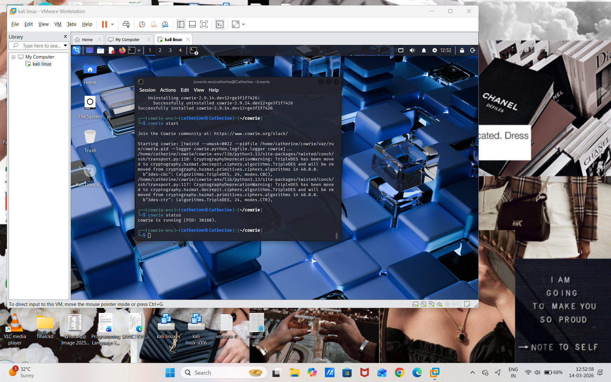
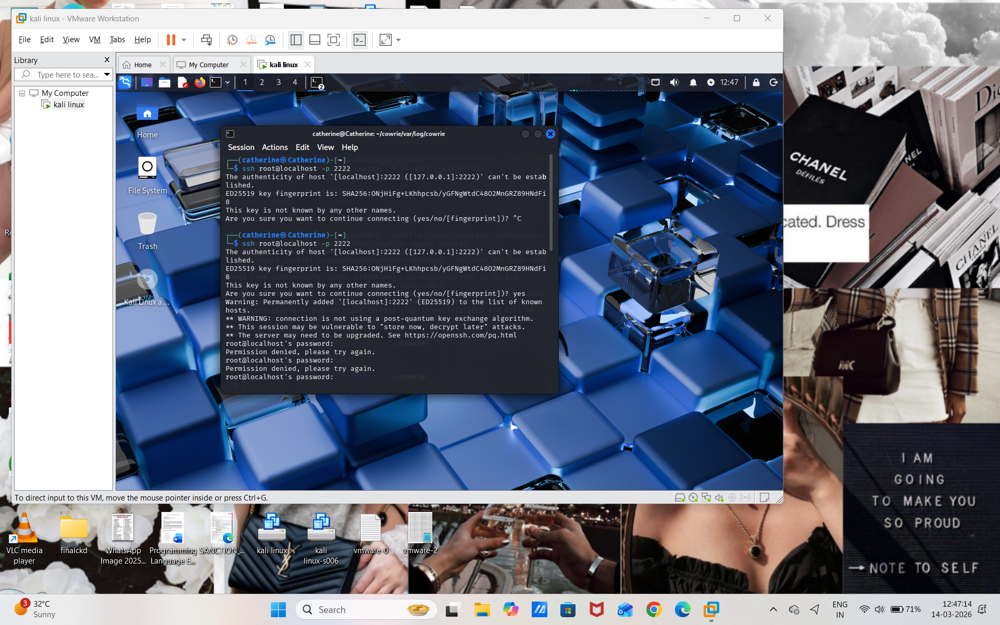

# IoT Deception Honeypot Network

## Project Overview
This project demonstrates the deployment of an IoT deception honeypot using Cowrie in Kali Linux.  
The honeypot simulates a vulnerable IoT device and captures attacker login attempts.

The system records attacker activities such as:
- SSH login attempts
- Password brute-force attacks
- Session activity
- Commands executed by attackers

---

## Tools Used
- Kali Linux
- VMware Workstation
- Cowrie SSH Honeypot
- GitHub

---

## Honeypot Deployment

### Step 1 – Install Cowrie
git clone https://github.com/cowrie/cowrie.git

cd cowrie

### Step 2 – Create Virtual Environment
python3 -m venv cowrie-env

source cowrie-env/bin/activate

### Step 3 – Install Requirements
pip install -r requirements.txt

### Step 4 – Configure Cowrie
cp etc/cowrie.cfg.dist etc/cowrie.cfg

---

## Start Honeypot

Run:

cowrie start

Check status:

cowrie status

Output:

cowrie is running

---

## Simulating an Attack

SSH attack simulation:

ssh root@localhost -p 2222

Password attempts used:

root  
admin  
123456  
password  

---

## Captured Logs

Logs captured using:

cd ~/cowrie/var/log/cowrie

tail -f cowrie.log

Example captured activity:

connection from 127.0.0.1  
login attempt  
Getting shell  
session closed  

---

## Screenshots

1. Cowrie Honeypot Running  
2. SSH Attack Attempt  
3. Cowrie Log Capturing Attacker Activity  

---

## Outcome

The honeypot successfully captured attacker login attempts and session activity.  
This demonstrates how deception technology can be used to detect unauthorized access attempts and gather threat intelligence.

---

## Author
Catherine 
=======
# IoT Honeypot Network using Cowrie

## Project Overview
This project demonstrates the deployment of a Cowrie SSH/Telnet honeypot to monitor and capture malicious activities targeting IoT systems.

The honeypot simulates a vulnerable device to attract attackers and record their behavior for cybersecurity analysis.

## Tools Used
- Kali Linux
- Cowrie Honeypot
- GitHub

## Features
- Detects SSH brute force attacks
- Logs attacker login attempts
- Records commands executed by attackers
- Helps analyze attacker behavior

## Project Structure
bin/ – Cowrie executable scripts  
etc/ – Configuration files  
src/ – Source code  
var/ – Attack logs and captured data  

## How to Run the Honeypot

### Activate environment
source cowrie-env/bin/activate

### Start honeypot
bin/cowrie start

### Stop honeypot
bin/cowrie stop

### Check attacker logs

tail -f var/log/cowrie/cowrie.log

## Example Attack Detection
The honeypot records attacker login attempts and commands used during attacks.

## Week 2 – Honeypot Attack Capture

### Cowrie Honeypot Running

### SSH Login Attempt Simulation

### Cowrie Capturing Attack Logs

## Author
Catherine

    
>>>>>>> 7257254149be35ddf916f5e262d71929a9c2ac90
