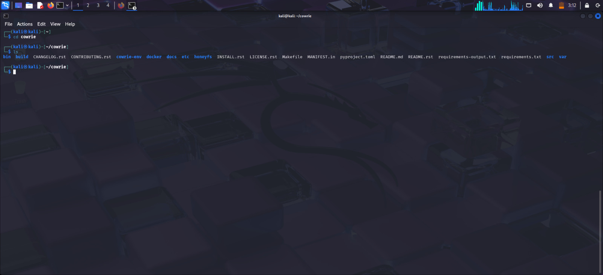
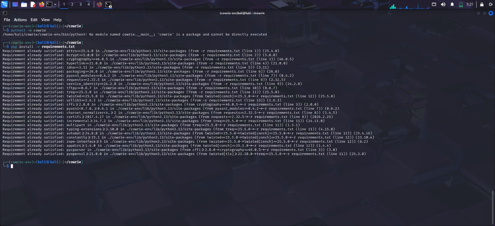
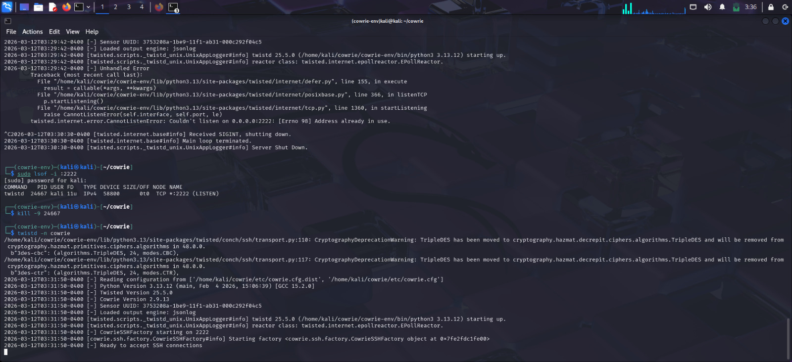
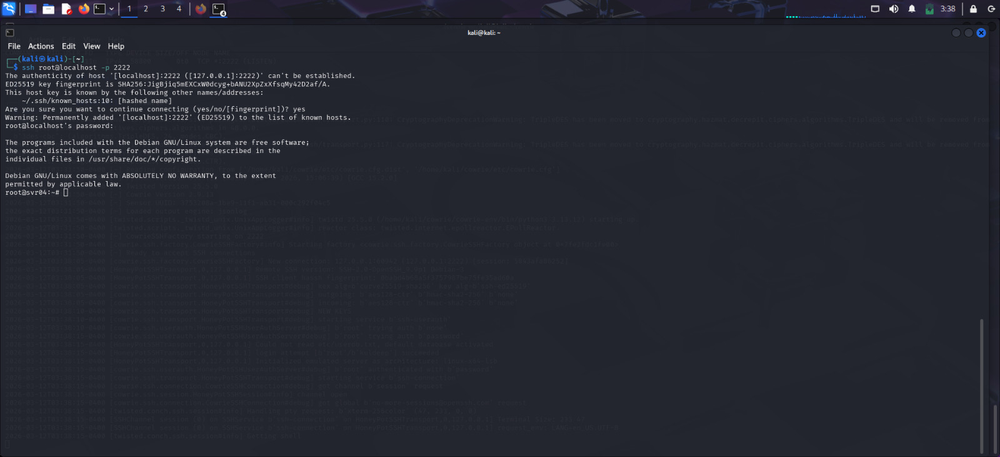
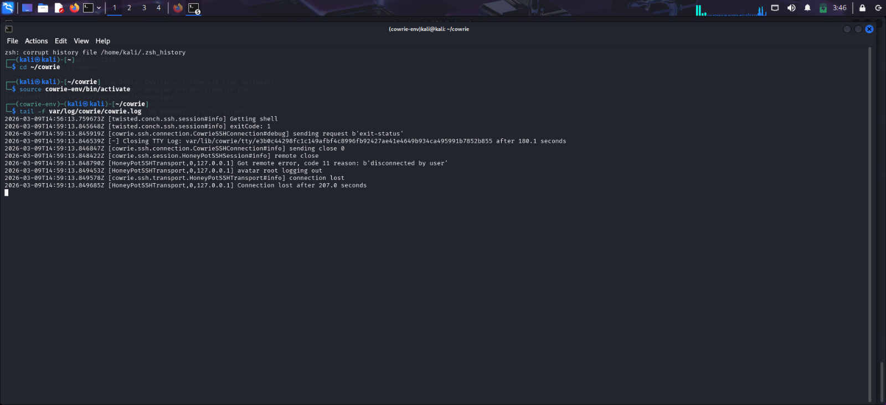

#  Week 1 - IoT Honeypot Setup

This section shows the step-by-step setup of the Cowrie honeypot.

---

##  Screenshots

### Kali Linux Terminal Started

### Activating the Python Virtual Environment

### Moving to Cowrie Directory

### Installing Requirements

### Starting the Honeypot

### Attacker Simulation (SSH Login)

### Viewing Honeypot Logs

## Author
-Kuldeep 
